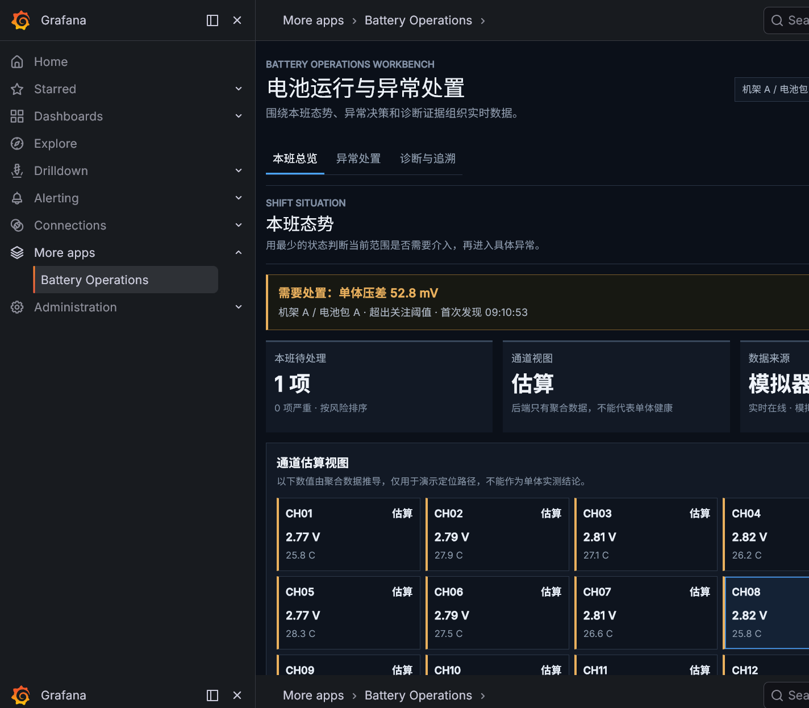
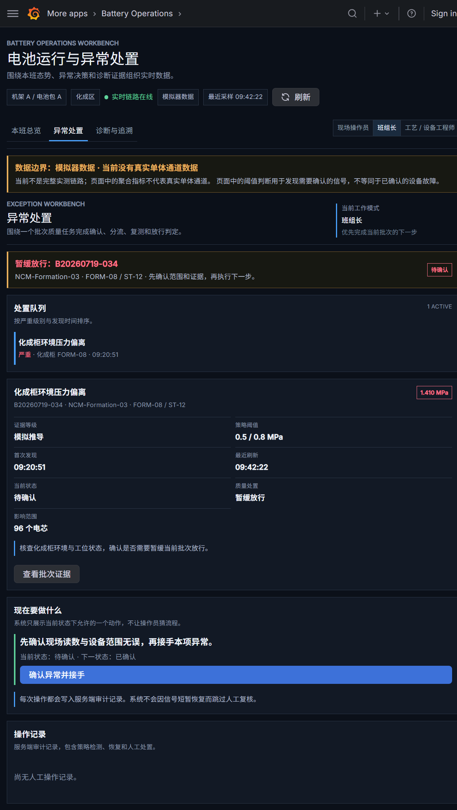
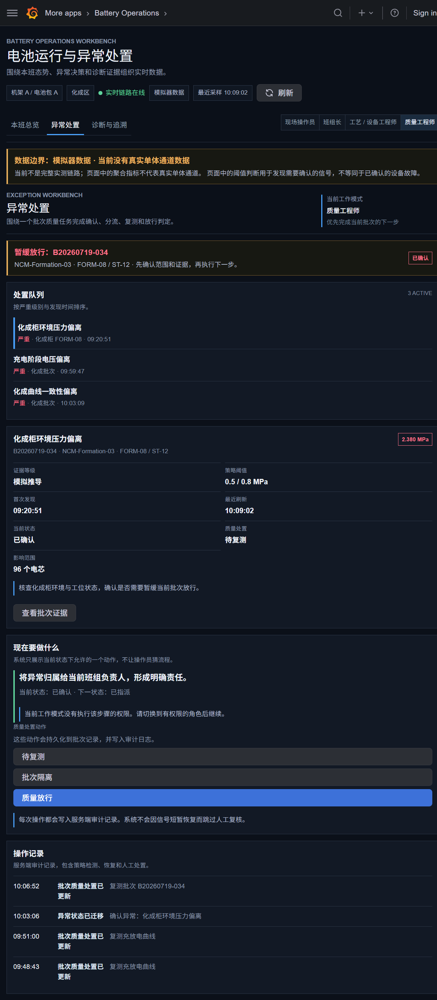
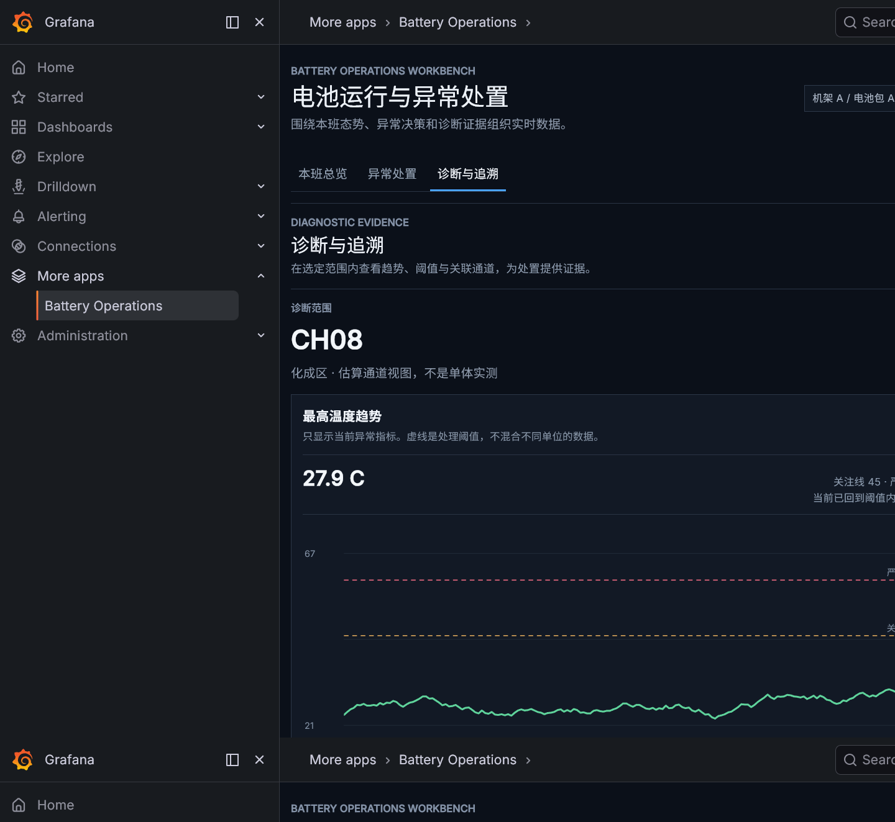

# Battery Dashboard Migration

## Battery Operations Workbench

当前 Grafana 二次开发成果是一个电池运行与异常处置工作台，包含本班总览、异常处置、诊断与追溯三个工作区。

员工运行入口：<http://127.0.0.1:3001/a/chenq-batteryops-app/operations?kiosk>

该入口使用 Grafana 的 kiosk 模式，隐藏 Grafana 顶栏和侧栏，员工直接进入电池业务工作台。运维管理仍可使用不带 `kiosk` 的地址：<http://127.0.0.1:3001/a/chenq-batteryops-app/operations>

### Demo Screenshots

#### 本班总览



#### 异常处置



#### 质量工程师处置



#### 诊断与追溯



完整备份范围和数据边界说明见 [BACKUP-MANIFEST.md](BACKUP-MANIFEST.md)。

This workspace now uses a split architecture:

- [frontend](C:/Users/chenq/Desktop/python学习/frontend): Next.js frontend
- [backend](C:/Users/chenq/Desktop/python学习/backend): FastAPI backend

## Run the backend

```bash
cd backend
uvicorn main:app --reload --port 8000
```

Open [http://127.0.0.1:8000/docs](http://127.0.0.1:8000/docs).

## Run the frontend

```bash
cd frontend
npm run dev
```

Open [http://localhost:3000](http://localhost:3000).

## Phase 1 Status

- Backend REST endpoint: `/api/current-data`
- Backend WebSocket endpoint: `/ws`
- Frontend: REST on mount, then WebSocket live updates
- Current mode: mock/fallback battery data until real Modbus integration is activated
